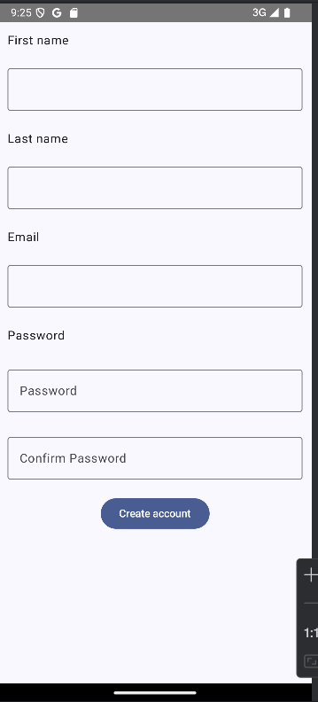
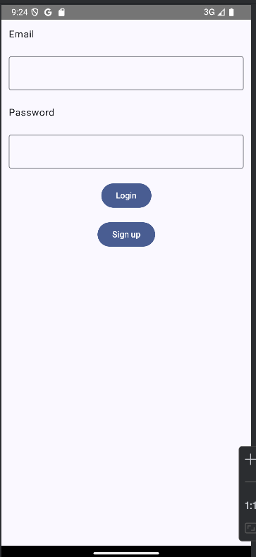
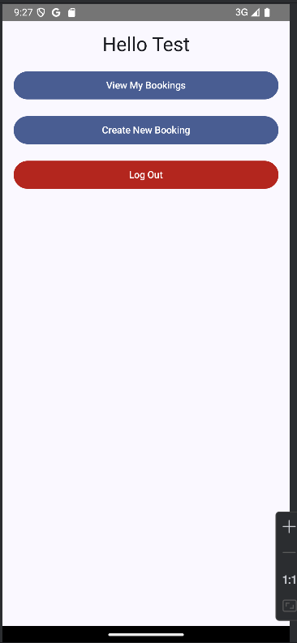

# Room Reservation Android App

## Recommended IDE Setup

[Android Studio](https://developer.android.com/studio) for Android development. Ensure you have the latest version installed for best compatibility.

## Project Setup

### Prerequisites
1. Install [Android Studio](https://developer.android.com/studio).
2. Ensure the Android SDK and JDK are properly configured.

### Build and Run
1. Open the project in Android Studio.
2. Sync the Gradle files.
3. Run the application on an emulator or a physical device:
   - **Development build:** Select the `Debug` build variant.
   - **Production build:** Select the `Release` build variant.

## User Manual

### Overview
The **Room Reservation** application allows users to:
- Create and manage reservations.
- Edit or delete existing reservations.
- Log in or sign up for an account.

### Features
1. **Sign-Up:** Create an account by providing your name, email, and password.
2. **Login:** Access the platform using your registered email and password.
3. **Reservation Management:**
   - View all your reservations in a list format.
   - Add new reservations with date, time, and room details.
   - Edit or delete existing reservations.
4. **Logout:** Securely log out of your account.

### Step-by-Step Guide

#### Sign-Up
1. Launch the application.
2. Click the **Sign Up** button on the login page.
3. Fill in the required details:
   - First Name
   - Last Name
   - Email
   - Password
   - Confirm Password
4. Click **Create Account** to register.
5. After successful registration, you'll be redirected to the login page.
       

#### Login
1. Enter your registered email and password on the login page.
2. Click the **Login** button to access your account.
3. If the login is successful, you will be redirected to the account dashboard.
       

#### Creating a Reservation
1. Click the **Create New Booking** button on the dashboard.
2. Fill in the following details:
   - Room Name
   - Date
   - Start Time
   - End Time
3. Click **Save** to add the reservation.
4. The new reservation will appear in the reservation list.
          

#### Editing a Reservation
1. Locate the reservation in the list.
2. Click the **Modify** button next to the reservation.
3. Update the required fields in the form.
4. Click **Save** to apply the changes.

#### Deleting a Reservation
1. Locate the reservation in the list.
2. Click the **Delete** button next to the reservation.
3. Confirm the deletion in the prompt.

#### Logging Out
1. Click the **Logout** button in the dashboard.
2. You will be redirected to the login page.